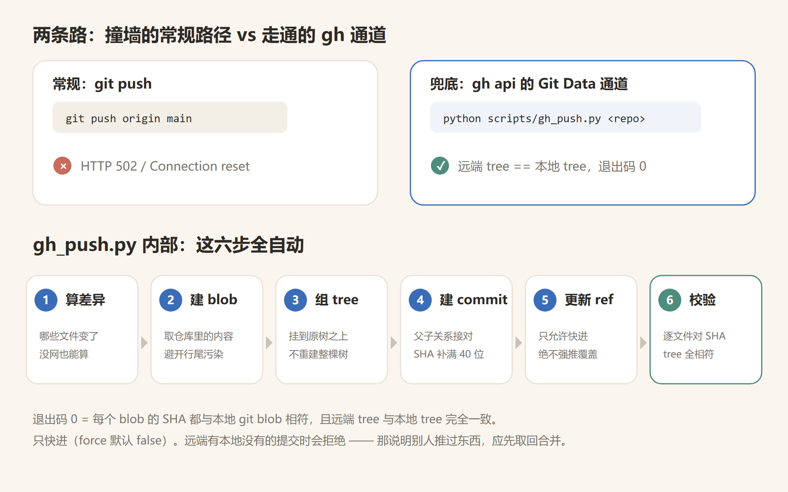
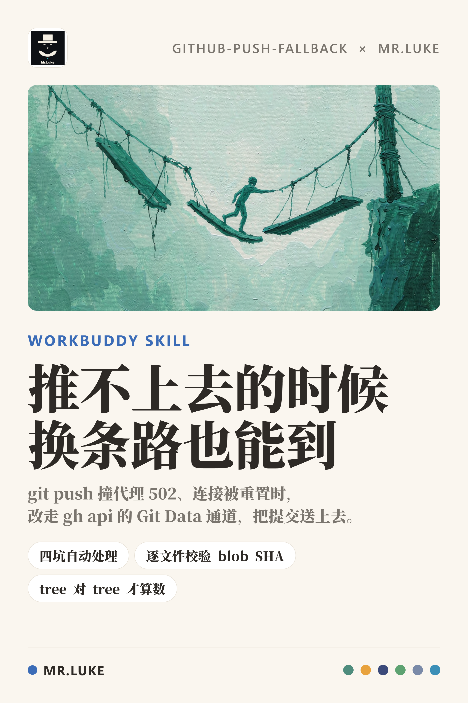

# github-push-fallback

> **`git push` 推不上去的时候，换条路把提交送上去。**

有时候 `git push` 会莫名其妙地失败：`Connection was reset`、`Failed to connect to github.com:443`、
代理隧道 `CONNECT tunnel failed, response 502`……但同一个网络下 `gh` 命令（GitHub 官方 CLI）却是好的。

这个 Skill 就是为这种情况准备的：**不改网络、不折腾代理，直接走 `gh api` 的 Git Data 通道，
把你的本地提交一个不少地送上 GitHub**，而且保留真实的提交历史。



---

## 一眼看懂：它和平时推送有什么不同

平时的 `git push` 走的是一条叫 HTTPS 的通道；`gh` 命令走的是另一条。
网络抽风的时候经常是"一条断了另一条还活着"。这个 Script 就是绕到还活着的那条上。

```
git push origin main          →  ✕  HTTP 502 / Connection reset
python scripts/gh_push.py .   →  ✓  远端 tree == 本地 tree，退出码 0
```

**关键点：怎么判断"真的推成功了"？** 不是看 `git push` 有没有报错，而是看**远端和本地的内容是否一致**。
Git 用一个叫 `tree` 的指纹来代表"整个目录的内容"，两边 `tree` 对上了，内容就是一个字节都不差。

---

## 快速开始

```bash
# 1. 先干跑一遍，看看它认为哪些文件有改动（不上传任何东西）
python scripts/gh_push.py /path/to/your/repo --dry-run

# 2. 确认文件清单符合预期，再真正推送
python scripts/gh_push.py /path/to/your/repo
```

**先跑 `--dry-run` 是硬性建议。** 如果清单里出现你没预期改过的文件（尤其是"几乎全部文件都变了"），
先查清原因再推——那通常是行尾符（Windows 的 CRLF vs Git 的 LF）在捣鬼，不是你真的改了几百个文件。

### 可用参数

| 参数 | 作用 |
|---|---|
| `--dry-run` | 只看差异，不上传 |
| `--branch <名>` | 指定分支（**默认跟随本地当前分支**，不是硬编码 main） |
| `--remote origin` | 指定远端名（默认 `origin`） |

> 为什么分支要跟随本地：`git init` 在部分配置下默认分支是 `master`。
> 如果硬编码推 `main`，内容会推到错误的分支上，而且**远端看起来"推成功了"、不报错**——
> 这是最难查的一类问题。

### 怎么算成功

命令退出码为 `0` 就算成功，它代表两件事同时成立：
每个文件的指纹都和本地 git 记录的一致，且**远端 `tree` 与本地 `tree` 完全相同**。

### 全新空仓库也能推

刚在 GitHub 建好的空仓库**整个 Git Data API 都是被禁用的**（连建 blob 都返回 409）。
脚本会自动先用另一条通道落一个"种子文件"把仓库激活，再走正常流程，你不需要做任何额外操作。

---

## 它替你处理了四个坑

这四条都是实际踩出来的，脚本已经自动处理。但如果你要排查问题，需要理解它们在说什么。

### ① "父提交"的哈希必须给满 40 位

Git 里每个提交的编号有 40 个字符长。方便起见平时可以只写前 7 位，但 GitHub 的 API 不接受缩写：

```
HTTP 422 Each SHA in the 'parents' parameter must be exactly 40 characters
```

脚本会自动取全量的 40 位编号。

### ② 千万不能拿工作目录里的文件直接上传

Windows 上工作目录的文件用的是 **CRLF** 换行，而 Git 仓库内部统一用 **LF**。
如果直接把工作目录的文件传上去，GitHub 收到的是 CRLF 版本，结果就是：

> 上传"成功"了，但远端的 `tree` 和本地对不上。

正确做法是从 Git 仓库内部取内容，而不是从磁盘读文件。脚本对每个文件都做这件事，并且逐一核对指纹。

### ③ 用 `--jq .content` 读文件内容会被截断

GitHub 返回文件内容时是 base64 编码的，中间会插入换行，`--jq` 取出来是残缺的。
要读文件内容得改用 raw 模式：

```bash
gh api repos/<owner>/<repo>/contents/README.md -H "Accept: application/vnd.github.raw"
```

### ④ 没有网络时怎么算出"哪些文件变了"

`git push` 不通通常意味着 `git fetch` 也不通。这时远端的提交在本地根本不存在，
平时用的 `git diff` 直接报错。脚本准备了两套算法：

| 情况 | 算法 |
|---|---|
| 远端提交在本地有 | 直接用 `git diff`，快 |
| 远端提交在本地没有 | **兜底**：把远端整棵目录树拉下来，和本地逐个文件比对指纹 |

兜底的算法不依赖 `git fetch`，代价是文件多的时候慢一些。

---

## 能力边界（这些做不到，别指望）

| 限制 | 说明 |
|---|---|
| **只能"快进"** | 默认 `force: false`。如果远端有你本地没有的提交（说明别人推过东西），脚本会拒绝而不是覆盖。这时应该先把远端内容取回本地合并，再走这个流程。**不要为了图快改成强制覆盖。** |
| **不适合超大改动** | 每个文件都要单独调一次 API，改动上百个文件时请优先想办法修好 `git push`。这个方案适合"必须把这次改动送上去"的场合。 |
| **删除文件要另外处理** | GitHub 的目录树 API 只能表达"覆盖某个文件"，没法表达"删掉某个文件"。删除文件要走另一条 API，具体做法见下方。 |

<details>
<summary>删除某个远端文件的完整做法</summary>

```bash
# 1. 先拿到这个文件的指纹
gh api repos/<owner>/<repo>/contents/<path> --jq .sha

# 2. 写 body.json
#    {"message":"删除某文件","sha":"<上一步拿到的指纹>","branch":"main"}

# 3. 调用删除接口
gh api --method DELETE repos/<owner>/<repo>/contents/<path> --input body.json
```

</details>

---

## 推送之后，本地为什么和远端"对不上"？

你会看到远端和本地的提交编号（SHA）不一样，但内容是完全相同的。**这是正常的**，不是出错了。

原因：通过 API 创建的提交，作者信息、时间戳和本地生成的不一样，所以编号必然不同。
**判断是否成功要看 `tree` 是否一致，不要去比提交编号。**

等网络恢复后，把本地的跟踪记录对齐一下：

```bash
git fetch origin && git reset --soft origin/main
```

---

## 怎么验证这个脚本本身是可靠的

改完脚本后，建议用真实场景验证，不要只看 `--dry-run`：

```bash
# 1. 造一个待推的提交
echo "selftest" > _selftest.txt && git add _selftest.txt && git commit -m "chore: selftest"
# 2. 跑脚本（应该识别出 1 个新增文件，推送后校验通过）
python scripts/gh_push.py /path/to/repo
# 3. 清理：本地回退 + 远端删文件（删法见上一节）
git reset --hard <原来的提交>
```

**最理想的检查方式：拿一个已知与远端内容完全一致的仓库跑 `--dry-run`，差异文件数应该是 0。**
如果不是 0，说明内容比对算法有偏差，先别推。

> ⚠️ **别在真实仓库上做推送自检。** 实推自检会在远端留下两个提交（自检提交 + 回退提交），
> 污染提交历史。`--dry-run` 已经覆盖了最容易出错的差异算法，实推环节风险低得多。

---

## 目录结构

```
github-push-fallback/
├── SKILL.md                    # Skill 定义（何时触发、完整操作手册）
├── scripts/
│   └── gh_push.py              # 核心脚本，一条命令完成全流程
├── docs/
│   ├── diagram.svg             # 示意图源文件
│   └── diagram.png             # 示意图（README 用）
├── examples/
│   └── poster-github-push-fallback.png
└── LICENSE
```

---

## 宣传海报



---

## License

MIT © 2026 MR.LUKE
